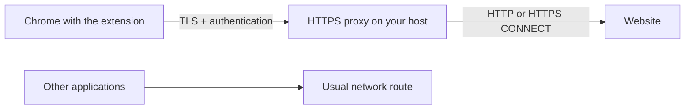

# Self-Hosted Browser VPN

**English** · [Русский](README.md)

[](https://github.com/coffegorio/self-hosted-browser-vpn/actions/workflows/ci.yml)

[Docker Compose](deploy/README.en.md) · [Ubuntu](docs/installation.md) · [Connect Chrome](docs/usage.md) · [Troubleshooting](docs/troubleshooting.md) · [Changelog](CHANGELOG.md) · [Contributing](CONTRIBUTING.md)


**Your server, for Chrome traffic only.** The extension enables an HTTPS proxy hosted on your own server in the current browser profile. Applications outside Chrome keep their usual network route.

> [!IMPORTANT]
> Despite its name, this is **a browser proxy, not a system-wide VPN**. It does not create a device-wide network tunnel and cannot guarantee that every kind of Chrome traffic goes through it. See [what it routes and its limits](docs/architecture.md) (Russian).



## What it does today

- Routes ordinary Chrome web requests through an authenticated HTTPS proxy on your server.
- Runs with Docker Compose on Linux, macOS, and Windows hosts with Linux containers; **Ubuntu 24.04/26.04** also has a native installer. Both methods produce a connection key for the extension.
- Obtains a Let's Encrypt certificate for a public IPv4 address or domain and configures automatic renewal.
- Lets you connect or disconnect, exclude selected sites, and check the browser's external IP.
- Requires no project cloud account: you control the server and connection key.

This project is an **MVP**. The extension is loaded locally in Chrome's developer mode; it is not published in the Chrome Web Store yet. HTTP and HTTPS websites are supported. The proxy restricts destinations to public addresses and ports `80`, `443`, `8080`, `8443`, and `9443`.

## Quick start

You need a host reachable from the internet through a public IPv4 address or domain. Allow inbound **80/TCP** for certificate issuance and renewal, and **443/TCP** for the proxy. If 443 is occupied, choose a free port such as **8443/TCP**. Both ports must pass your firewalls and, if the host is behind NAT, be forwarded to it.

### Linux, macOS, and Windows: Docker Compose

Install Docker with Compose and Linux container support. Docker Desktop works on supported macOS and desktop Windows versions. On Linux/macOS:

```bash
git clone https://github.com/coffegorio/self-hosted-browser-vpn.git
cd self-hosted-browser-vpn
cp deploy/settings.env.example deploy/settings.env
```

In Windows PowerShell, use `Copy-Item deploy/settings.env.example deploy/settings.env` instead of `cp`. Edit `deploy/settings.env` and set your own `SHBVPN_KIND=domain` with `SHBVPN_HOST=...` or `SHBVPN_KIND=ip` with a public IPv4 address. Then, from the repository root on any supported system:

```bash
docker compose --env-file deploy/settings.env -f deploy/compose.yaml up --build -d
docker compose --env-file deploy/settings.env -f deploy/compose.yaml ps
```

Once all three containers are `healthy`, retrieve the key:

```bash
docker compose --env-file deploy/settings.env -f deploy/compose.yaml exec cert-manager python3 /app/manager.py show-key
```

See the [Docker Compose guide](deploy/README.en.md) for checks and platform limits. Docker Desktop does not support Windows Server; this deployment does not claim native support for every OS.

### Ubuntu 24.04/26.04: without Docker

You need `sudo` access and `git`. On the VPS:

```bash
git clone https://github.com/coffegorio/self-hosted-browser-vpn.git
cd self-hosted-browser-vpn
sudo bash installer/install.sh --ip YOUR_PUBLIC_IPV4
```

If 443/TCP is in use:

```bash
sudo bash installer/install.sh --ip YOUR_PUBLIC_IPV4 --port 8443
```

For a domain with an A record pointing to the VPS:

```bash
sudo bash installer/install.sh --domain proxy.example.com --port 8443
```

Replace the example address and port with your own. A successful installation prints a key beginning with `shbvpn1:`. **This is a secret:** do not put it on GitHub, in screenshots, or in messages. To display it again, run `sudo shbvpn --show-key` on the server.

### Connect Chrome — for either installation method

If you cloned the project only on the server, download it to your Chrome computer too: run the `git clone` command above, or select **Code → Download ZIP** on the repository page and extract the archive.

In Chrome **108 or newer**, open `chrome://extensions` → enable **Developer mode** → select **Load unpacked** → choose the project's `extension` folder **on your computer**. Open the extension, paste the key, click **Добавить сервер** (Add server), then **Подключить** (Connect) and **Проверить внешний IP** (Check external IP). Compare the displayed address with the proxy host's outbound IP.

For detailed Ubuntu steps, see [installation](docs/installation.md) → [usage](docs/usage.md). If something fails, see [troubleshooting](docs/troubleshooting.md). These detailed guides are currently in Russian.

## How it works

The extension applies a PAC rule to the current Chrome profile: ordinary websites use your HTTPS proxy, while explicitly excluded domains open directly. For websites selected for proxying, the rule has no `DIRECT` fallback. The server checks the username and password, then connects to the website's public address. HTTPS uses a `CONNECT` tunnel, so the website's TLS connection remains between the browser and the website. See [architecture](docs/architecture.md) (Russian).

The green **ON** indicator means Chrome applied the extension's settings. It **does not check whether the proxy host is reachable**. To test the connection, use **Проверить внешний IP** (Check external IP) and open the website you need. The extension shows `!` if Chrome reports a proxy error or settings conflict.

## Management

For the Ubuntu installation without Docker:

```bash
sudo shbvpn --show-key   # display the connection key again
sudo shbvpn --rotate     # change the password; the previous key stops working
sudo shbvpn --uninstall  # remove the project's services, configuration, and certificate
```

For a Docker installation, see the [Compose management commands](deploy/README.en.md) for displaying or rotating the key and stopping or removing services. After rotation, import the new key using **Заменить сервер** (Replace server) in the extension. Disconnecting returns Chrome to its usual settings and keeps the key for the next connection.

More details: [usage](docs/usage.md), [security](docs/security.md), and [development and tests](docs/development.md) (currently in Russian).

## FAQ

**Can I use an existing Amnezia installation?** This project does not import AmneziaVPN, AWG, or XRay configuration. It runs a separate HTTPS proxy on the selected host, including the same VPS if you choose. If port 443 is occupied, choose a free proxy port; port 80 is needed for the certificate.

**Can I use the key on several devices?** Yes, but the proxy currently has one shared password. Rotating it revokes the old key on every device; with Compose, restart the proxy container after rotation.

**Will websites see my server's IP?** Websites reached by ordinary web requests through the proxy will see the proxy host's outbound IP. Excluded domains open directly; with NAT or IPv6, the outbound address may differ from the address used to connect to the server. Check your particular browser and website.

## Limits you should know

- Applications outside Chrome, other profiles, and incognito mode do not connect automatically. Incognito requires separate permission for the extension and separate verification.
- Some internal Chrome connections, local addresses, DNS, and WebRTC may be handled outside the ordinary web proxy. The extension restricts direct UDP for WebRTC, but that may interfere with calls.
- The server does not proxy UDP or QUIC. Websites on ports outside the allowed list will not open through it.
- Excluded domains **intentionally** connect directly. Another extension or a Chrome policy may prevent this extension from controlling the proxy.
- Check the certificate, connection, and IP on your own network. Local tests do not prove that it works on every host or in every Chrome environment.

Found a bug or want to suggest a feature? Open an issue with the host OS, Docker or Ubuntu version, Chrome version, the installation command **without the key**, the observed error, and relevant service output without secrets.

## License

[MIT](LICENSE) © 2026 coffegorio.
