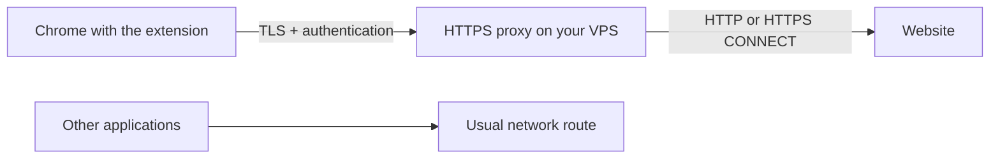

# Self-Hosted Browser VPN

**English** · [Русский](README.md)

[](https://github.com/coffegorio/self-hosted-browser-vpn/actions/workflows/ci.yml)


**Your VPS, for Chrome traffic only.** The extension enables an HTTPS proxy hosted on your own server in the current browser profile. Applications outside Chrome keep their usual network route.

> [!IMPORTANT]
> Despite its name, this is **a browser proxy, not a system-wide VPN**. It does not create a device-wide network tunnel and cannot guarantee that every kind of Chrome traffic goes through it. See [what it routes and its limits](docs/architecture.md) (Russian).



### What it does today

- Routes ordinary Chrome web requests through an authenticated HTTPS proxy on your server.
- Installs on **Ubuntu 24.04 or 26.04** and produces one connection key to import into the extension.
- Obtains a Let's Encrypt certificate for a public IPv4 address or domain and configures automatic renewal.
- Lets you connect or disconnect, exclude selected sites, and check the browser's external IP.
- Requires no project cloud account: you control the server and connection key.

This project is an **MVP**. The extension is loaded locally in Chrome's developer mode; it is not published in the Chrome Web Store yet. HTTP and HTTPS websites are supported. The proxy restricts destinations to public addresses and ports `80`, `443`, `8080`, `8443`, and `9443`.

## Quick start

You need a VPS running Ubuntu 24.04/26.04, a public IPv4 address, and `sudo` access. Allow inbound **80/TCP** for certificate issuance and renewal, and **443/TCP** for the proxy. If 443 is already in use, choose another free port, such as **8443/TCP**. Both ports must be allowed in your hosting provider's firewall and any firewall configured on the server.

On the VPS:

```bash
git clone https://github.com/coffegorio/self-hosted-browser-vpn.git
cd self-hosted-browser-vpn
sudo bash installer/install.sh --ip YOUR_PUBLIC_IPV4
```

If 443/TCP is in use:

```bash
sudo bash installer/install.sh --ip YOUR_PUBLIC_IPV4 --port 8443
```

For a domain with an A record pointing to the VPS:

```bash
sudo bash installer/install.sh --domain proxy.example.com --port 8443
```

Replace the example address and port with your own. A successful installation prints a key beginning with `shbvpn1:`. **This is a secret:** do not put it on GitHub, in screenshots, or in messages. To display it again, run `sudo shbvpn --show-key` on the server.

In Chrome, open `chrome://extensions` → enable **Developer mode** → select **Load unpacked** → choose the project's `extension` folder **on your computer**. Open the extension, paste the key, click **Добавить сервер** (Add server), then **Подключить** (Connect) and **Проверить внешний IP** (Check external IP). Compare the displayed address with the VPS's outbound IP.

For detailed steps, including port setup and service checks, see [installation](docs/installation.md) → [usage](docs/usage.md). If something fails, see [troubleshooting](docs/troubleshooting.md). These detailed guides are currently in Russian.

## How it works

The extension applies a PAC rule to the current Chrome profile: ordinary websites use your HTTPS proxy, while explicitly excluded domains open directly. For websites selected for proxying, the rule has no `DIRECT` fallback. The server checks the username and password, then connects to the website's public address. HTTPS uses a `CONNECT` tunnel, so the website's TLS connection remains between the browser and the website. See [architecture](docs/architecture.md) (Russian).

The green **ON** indicator means Chrome applied the extension's settings. It **does not check whether the VPS is reachable**. To test the connection, use **Проверить внешний IP** (Check external IP) and open the website you need. The extension shows `!` if Chrome reports a proxy error or settings conflict.

## Management

```bash
sudo shbvpn --show-key   # display the connection key again
sudo shbvpn --rotate     # change the password; the previous key stops working
sudo shbvpn --uninstall  # remove the project's services, configuration, and certificate
```

After `--rotate`, import the new key using **Заменить сервер** (Replace server) in the extension. Disconnecting returns Chrome to its usual settings and keeps the key for the next connection.

More details: [usage](docs/usage.md), [security](docs/security.md), and [development and tests](docs/development.md) (currently in Russian).

## FAQ

**Can I use an existing Amnezia installation?** This project does not import AmneziaVPN, AWG, or XRay configuration. It installs a separate HTTPS proxy on the same VPS. If port 443 is occupied, choose a free proxy port; port 80 is needed for the certificate.

**Can I use the key on several devices?** Yes, but the proxy currently has one shared password. The `--rotate` command revokes the old key on every device at once.

**Will websites see my VPS's IP?** Websites reached by ordinary web requests through the proxy will see the VPS's outbound IP. Excluded domains open directly; with NAT or IPv6, the outbound address may differ from the address used to connect to the VPS. Check your particular browser and website.

## Limits you should know

- Applications outside Chrome, other profiles, and incognito mode do not connect automatically. Incognito requires separate permission for the extension and separate verification.
- Some internal Chrome connections, local addresses, DNS, and WebRTC may be handled outside the ordinary web proxy. The extension restricts direct UDP for WebRTC, but that may interfere with calls.
- The server does not proxy UDP or QUIC. Websites on ports outside the allowed list will not open through it.
- Excluded domains **intentionally** connect directly. Another extension or a Chrome policy may prevent this extension from controlling the proxy.
- Check the certificate, connection, and IP on your own network. Local tests do not prove that it works on every VPS or in every Chrome environment.

Found a bug or want to suggest a feature? Open an issue with your Ubuntu and Chrome versions, the installation command **without the key**, the observed error, and relevant service output without secrets.

## License

[MIT](LICENSE) © 2026 coffegorio.
