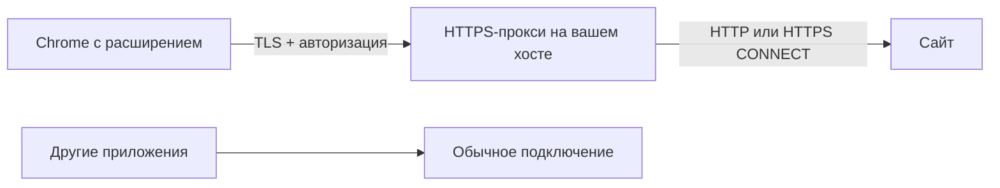

# Self-Hosted Browser VPN

**Русский** · [English](README.en.md)

[](https://github.com/coffegorio/self-hosted-browser-vpn/actions/workflows/ci.yml)

[Docker Compose](deploy/README.md) · [Ubuntu](docs/installation.md) · [Подключение Chrome](docs/usage.md) · [Решение проблем](docs/troubleshooting.md) · [Изменения](CHANGELOG.md) · [Участие в проекте](CONTRIBUTING.md)


**Ваш сервер — только для трафика Chrome.** Расширение включает собственный HTTPS-прокси в текущем профиле браузера. Остальные приложения компьютера продолжают пользоваться своим обычным подключением.

> [!IMPORTANT]
> Несмотря на название, это **браузерный прокси, а не системный VPN**. Он не создаёт сетевой туннель для всего устройства и не гарантирует маршрутизацию каждого вида трафика Chrome. [Что проходит через него и где границы](docs/architecture.md).



## Что умеет сейчас

- Подключает обычные веб-запросы Chrome к вашему серверу через HTTPS-прокси с авторизацией.
- Запускается через Docker Compose на Linux, macOS и Windows с Linux-контейнерами; для **Ubuntu 24.04/26.04** есть отдельный установщик без Docker. Оба способа выдают ключ для расширения.
- Получает сертификат Let's Encrypt для публичного IPv4-адреса или домена и настраивает автоматическое продление.
- Позволяет включать и отключать прокси, задавать исключения для сайтов и проверять внешний IP из Chrome.
- Не использует облачный аккаунт проекта: сервер и ключ подключения находятся под вашим управлением.

Проект находится на стадии **MVP**. Расширение загружается локально через режим разработчика Chrome; публикации в Chrome Web Store пока нет. Поддерживаются HTTP и HTTPS-сайты. Прокси ограничивает назначения публичными адресами и портами `80`, `443`, `8080`, `8443`, `9443`.

## Быстрый старт

Нужен хост, доступный из интернета по публичному IPv4 или домену. Подготовьте входящие **80/TCP** для выпуска и продления сертификата и **443/TCP** для прокси. Если 443 уже занят, можно выбрать другой свободный порт, например **8443/TCP**. Оба порта должны быть доступны через файрволы и, если хост за NAT, перенаправлены на него.

### Linux, macOS и Windows: Docker Compose

Установите Docker с Compose и поддержкой Linux-контейнеров. На macOS и настольной Windows можно использовать Docker Desktop. На Linux/macOS:

```bash
git clone https://github.com/coffegorio/self-hosted-browser-vpn.git
cd self-hosted-browser-vpn
cp deploy/settings.env.example deploy/settings.env
```

В Windows PowerShell используйте `Copy-Item deploy/settings.env.example deploy/settings.env` вместо `cp`. В `deploy/settings.env` укажите собственный `SHBVPN_KIND=domain` и `SHBVPN_HOST=...` либо `SHBVPN_KIND=ip` и публичный IPv4. Затем из корня проекта на любой из поддерживаемых систем:

```bash
docker compose --env-file deploy/settings.env -f deploy/compose.yaml up --build -d
docker compose --env-file deploy/settings.env -f deploy/compose.yaml ps
```

Когда все три контейнера станут `healthy`, получите ключ:

```bash
docker compose --env-file deploy/settings.env -f deploy/compose.yaml exec cert-manager python3 /app/manager.py show-key
```

Подробные шаги, проверки и ограничения платформ: [установка через Docker Compose](deploy/README.md). Docker Desktop не поддерживается на Windows Server; контейнерный запуск не означает нативную поддержку каждой ОС.

### Ubuntu 24.04/26.04: без Docker

Нужны доступ `sudo` и установленный `git`. На VPS:

```bash
git clone https://github.com/coffegorio/self-hosted-browser-vpn.git
cd self-hosted-browser-vpn
sudo bash installer/install.sh --ip ВАШ_ПУБЛИЧНЫЙ_IPV4
```

Если 443/TCP занят:

```bash
sudo bash installer/install.sh --ip ВАШ_ПУБЛИЧНЫЙ_IPV4 --port 8443
```

Для домена с A-записью, указывающей на VPS:

```bash
sudo bash installer/install.sh --domain proxy.example.com --port 8443
```

Замените адрес и порт на свои. В конце успешной установки появится ключ с префиксом `shbvpn1:`. **Это секрет:** не публикуйте его в GitHub, скриншотах и сообщениях. Если понадобится показать ключ повторно, выполните `sudo shbvpn --show-key` на сервере.

### Подключить Chrome — для обоих способов установки

Если проект скачан только на сервер, скачайте его также на компьютер с Chrome: выполните `git clone` из инструкции выше или выберите **Code → Download ZIP** на странице репозитория и распакуйте архив.

В Chrome **108 или новее** откройте `chrome://extensions` → включите **Режим разработчика** → **Загрузить распакованное расширение** → выберите папку `extension` из скачанного проекта **на вашем компьютере**. Откройте расширение, вставьте ключ, нажмите **Добавить сервер**, затем **Подключить** и **Проверить внешний IP**. Сравните показанный адрес с исходящим IP хоста прокси.

Подробная последовательность для Ubuntu: [установка](docs/installation.md) → [использование](docs/usage.md). Если что-то не заработало, откройте [решение проблем](docs/troubleshooting.md).

## Как устроено

Расширение применяет к текущему профилю Chrome правило PAC: обычные сайты идут на ваш HTTPS-прокси, а явно указанные исключения открываются напрямую. Для сайтов, выбранных для проксирования, в правиле нет запасного маршрута `DIRECT`. Сервер проверяет логин и пароль, затем соединяется с публичным адресом сайта. Для HTTPS используется туннель `CONNECT`: TLS сайта остаётся между браузером и сайтом. Подробнее — в [архитектуре](docs/architecture.md).

Зелёный индикатор **ON** означает, что Chrome применил настройки расширения. Он **не проверяет доступность хоста прокси**. Для проверки соединения используйте кнопку **Проверить внешний IP** и откройте нужный сайт. При ошибке прокси или конфликте настроек расширение показывает `!`.

## Управление

Для установки без Docker на Ubuntu:

```bash
sudo shbvpn --show-key   # снова показать ключ подключения
sudo shbvpn --rotate     # сменить пароль; прежний ключ перестанет работать
sudo shbvpn --uninstall  # удалить сервисы, конфигурацию и сертификат проекта
```

Для установки через Docker команды показа и смены ключа, остановки и удаления приведены в [руководстве Compose](deploy/README.md). После смены пароля импортируйте новый ключ через **Заменить сервер** в расширении. Отключение в расширении возвращает Chrome к его обычным настройкам и сохраняет ключ для следующего подключения.

Подробности: [использование](docs/usage.md), [безопасность](docs/security.md), [проверки и разработка](docs/development.md).

## Частые вопросы

**Можно использовать уже установленную Amnezia?** Проект не импортирует конфигурацию AmneziaVPN, AWG или XRay. Он запускает отдельный HTTPS-прокси на выбранном хосте, в том числе на том же VPS. Если порт 443 занят, выберите свободный порт прокси; порт 80 нужен для сертификата.

**Можно дать ключ нескольким устройствам?** Да, но сейчас это один общий пароль прокси. Смена пароля отзовёт старый ключ у всех устройств; для Compose после смены требуется перезапустить контейнер прокси.

**Будет ли у сайтов IP моего сервера?** У обычных веб-запросов, прошедших через прокси, сайт увидит исходящий IP хоста прокси. Исключения открываются напрямую; при NAT и IPv6 исходящий адрес может отличаться от адреса подключения к серверу. Проверяйте конкретный браузер и сайт.

## Ограничения, которые важно знать

- Приложения вне Chrome, отдельные профили и режим инкогнито не подключаются автоматически. Для инкогнито требуется отдельное разрешение расширения и отдельная проверка.
- Некоторые внутренние соединения Chrome, локальные адреса, DNS и WebRTC могут обрабатываться вне обычного веб-прокси. Расширение ограничивает прямой UDP для WebRTC, но это может мешать звонкам.
- UDP и QUIC сервер не проксирует. Сайты на портах вне разрешённого списка не откроются через него.
- Исключённые домены **намеренно** идут напрямую. Конфликт с другим расширением или политикой Chrome может помешать подключению.
- Сертификат, соединение и IP нужно проверять на своей сети. Локальные тесты не доказывают работу на каждом хосте и в каждом окружении Chrome.

Нашли ошибку или хотите предложить функцию? Создайте issue с ОС хоста, версией Docker либо Ubuntu, версией Chrome, командой установки **без ключа**, наблюдаемой ошибкой и выводом соответствующей службы без секретов.

## Лицензия

[MIT](LICENSE) © 2026 coffegorio.
