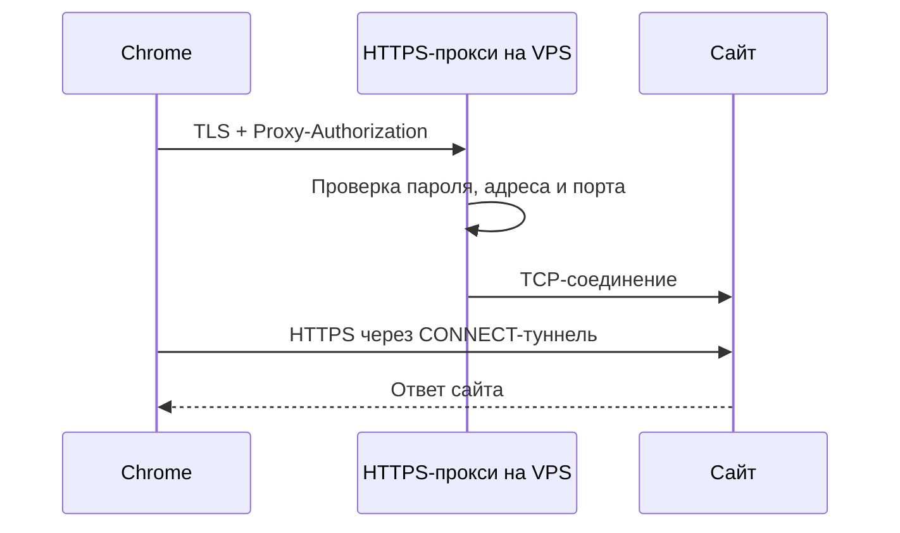

# Архитектура и границы маршрутизации

Проект состоит из Go-сервера на вашем VPS и расширения Chrome Manifest V3. Он использует штатные настройки прокси Chrome и не создаёт системный сетевой интерфейс.

Для HTTP-сайта прокси пересылает запрос и видит его содержимое. Для HTTPS-сайта браузер отправляет `CONNECT`, а затем устанавливает TLS-соединение с самим сайтом внутри туннеля. Внешний TLS между браузером и VPS защищает авторизацию и адрес назначения от наблюдателя на пути до VPS. Сервер видит имя или IP назначения; HTTPS-содержимое сайта защищено отдельным TLS до сайта.

## Сервер

Go-процесс принимает HTTPS-соединения с HTTP/1.1 на выбранном TCP-порту, проверяет HTTP Basic-авторизацию и обрабатывает HTTP-запросы и `CONNECT`. Перед соединением он разрешает переданное ему DNS-имя, отбрасывает локальные, частные, link-local и некоторые зарезервированные IP-адреса и разрешает только порты назначения `80`, `443`, `8080`, `8443` и `9443`. При нескольких публичных адресах назначения пробует их по очереди. Исходящее соединение с сайтом устанавливает VPS.

На `80/TCP` работает отдельная служба HTTP-01, которая отдаёт только файлы ACME-проверки. Установщик получает сертификат Let's Encrypt для домена или публичного IPv4, копирует сертификат в каталог службы и настраивает продление. Обе службы работают от системного пользователя `shbvpn`. Подробнее: [установка](installation.md).

## Расширение

После импорта ключа расширение хранит настройки в `chrome.storage.local`. Ключ формата `shbvpn1:` содержит base64url-кодированный JSON версии 1 с полями `host`, `port`, `username`, `password`. Это кодирование, не шифрование.

При подключении расширение задаёт `chrome.proxy.settings` с PAC-скриптом и параметром `mandatory: true`. Для обычного сайта скрипт возвращает ровно `HTTPS host:port`, без `DIRECT` в качестве запасного маршрута. Для явно исключённого домена и его поддоменов он возвращает `DIRECT`. Расширение также устанавливает политику WebRTC `disable_non_proxied_udp` и передаёт учётные данные только в ответ на подходящий вызов авторизации прокси `407`. Оно проверяет, что Chrome сообщает о применении этих настроек.

| Запрос | PAC-решение | Ожидаемый путь |
| --- | --- | --- |
| Обычный HTTPS-сайт | `HTTPS host:port` | Chrome → VPS → сайт |
| Обычный HTTP-сайт | `HTTPS host:port` | Chrome → VPS → сайт |
| Домен из исключений и его поддомены | `DIRECT` | Chrome → сайт напрямую |
| Приложение вне Chrome | Не участвует | Обычный маршрут приложения |

Статус **ON** означает, что расширение контролирует ожидаемые настройки Chrome. Внешний IP проверяется отдельным запросом к `api.ipify.org`. Ошибка прокси, неудачная авторизация или конфликт настроек показываются отдельно. Отключение снимает прокси и WebRTC-политику этого расширения; остальные политики Chrome остаются в силе.

## Почему это не полноценный VPN

Штатный браузерный прокси распространяется на обычные веб-запросы профиля. Chrome может обходить его для локальных адресов и собственных служебных операций. Поведение DNS, IPv6, WebRTC, режима инкогнито, расширений и сетевых политик зависит от Chrome и окружения. Исключения намеренно идут напрямую. Сервер работает поверх TCP и не проксирует UDP или QUIC. Поэтому нельзя обещать, что **весь** трафик браузера выйдет с IP VPS или что не будет утечек в любой конфигурации.

Для важных сценариев проверяйте именно свою систему: внешний IP в Chrome, доступ к нужным сайтам, поведение исключений, работу инкогнито при его использовании, WebRTC-звонки, восстановление после перезапуска браузера и VPS. При недоступности прокси обычный PAC-маршрут не содержит `DIRECT`-fallback, но это не утверждение о каждом внутреннем сетевом механизме Chrome.

## Что проверяют тесты

Локальные тесты покрывают формат ключа, генерацию PAC, выбор исключений, авторизацию, TLS, `CONNECT` и отказ в доступе к внутренним адресам. Установщик на VPS дополнительно проверяет локальную службу и пробное продление сертификата. Только ручная проверка из реального Chrome на конкретной сети подтверждает, что запросы доходят до VPS и возвращают ожидаемый внешний IP. Команды тестов приведены в [документе для разработки](development.md).
